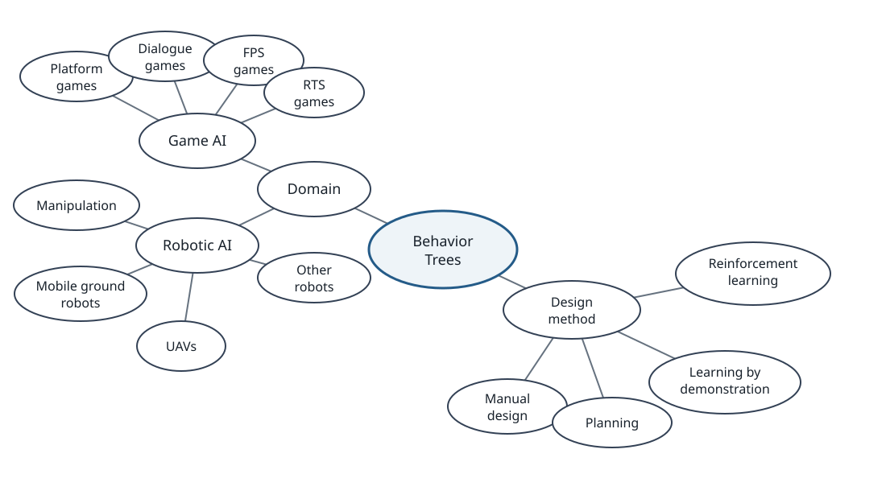

# Iovino et al. (2022) — A Survey of Behavior Trees in Robotics and AI

## Abstract

Behavior Trees (BTs) were invented as a tool to enable modular AI in computer games, but have received an increasing amount of attention in the robotics community in the last decade. With rising demands on agent AI complexity, game programmers found that the Finite State Machines (FSM) that they used scaled poorly and were difficult to extend, adapt and reuse. In BTs, the state transition logic is not dispersed across the individual states, but organized in a hierarchical tree structure, with the states as leaves. This has a significant effect on modularity, which in turn simplifies both synthesis and analysis by humans and algorithms alike. These advantages are needed not only in game AI design, but also in robotics, as is evident from the research being done. In this paper we present a comprehensive survey of the topic of BTs in Artificial Intelligence and Robotic applications. The existing literature is described and categorized based on methods, application areas and contributions, and the paper is concluded with a list of open research challenges.

*Verbatim abstract. The article is licensed CC BY.*

**Contribution / method.** The paper provides a field-level taxonomy of behavior-tree research spanning foundational theory, applications, design and synthesis methods, implementation libraries, and open research challenges. Its review method is explicit: the authors search Google Scholar, Scopus, and Clarivate Web of Science for both “Behavior Tree” and “Behaviour Tree,” restrict the corpus to English-language papers, remove the unrelated requirements-engineering meaning of the term, dead links, and duplicates, and then organize the retained literature by topic, application area, and methodology.

**Quantitative evidence.** The search produced **297 initial papers** and a cleaned corpus of **166 papers as of April 24, 2020**. Those numbers describe literature coverage rather than method performance: the survey does not perform a statistical meta-analysis, pool success rates, or estimate effect sizes comparing BTs with FSMs, planners, or learning methods.

**Advantages.** The strongest advantage is breadth combined with a reusable taxonomy. It gives a reader one map connecting game AI, manipulation, mobile robotics, aerial/underwater systems, learning, learning from demonstration, planning/analytic synthesis, manual design, theory, and software libraries. That organization is especially useful for locating a new paper relative to the rest of the field and for separating questions about BT execution semantics from questions about how a tree is designed or learned.

**Disadvantages / trade-offs.** The breadth of the survey necessarily limits depth on individual algorithms and empirical comparisons. Papers with very different assumptions, robot platforms, task difficulty, evaluation methodology, and maturity are grouped under common categories, so membership in the same category should not be read as evidence of equal performance or rigor. The taxonomy is excellent for navigation but does not by itself tell a practitioner which method is best for a particular deployment.

**Limitations.** The literature search is restricted to English and to papers discoverable with the two explicit BT spellings, so relevant work using different terminology can be missed. The corpus closes on April 24, 2020 even though the journal article appeared in 2022, which means later work in learning, synthesis, verification, multi-robot systems, and modern robotics software is absent. The review also does not report a formal risk-of-bias or paper-quality scoring procedure and does not weight conclusions by experimental strength. Finally, it is a taxonomy and narrative synthesis rather than a meta-analysis: it cannot support numerical claims that BTs are globally more reliable, faster, safer, or easier to maintain than alternative executive architectures.

- [Source abstract on arXiv](https://arxiv.org/abs/2005.05842)
- [Publisher article on ScienceDirect](https://www.sciencedirect.com/science/article/pii/S0921889022000513)

## Full text

- [arXiv PDF](https://arxiv.org/pdf/2005.05842)
- [Version of record](https://doi.org/10.1016/j.robot.2022.104096)

## Survey overview



*Repository redraw of the paper's Figure 1. The figure organizes the survey along two main dimensions: application domain and BT design method. Use the linked paper for the original figure.*

The overview is useful as the reading map for the entire paper. On the application side it separates game AI from robotic AI, then breaks robotics into manipulation, mobile ground robots, aerial/underwater robots, and other robotic systems. On the design side it separates manual design from learning, learning from demonstration, and planning/analytic approaches.

## Contents

1. Introduction, BT history, and core execution semantics
2. Fundamental theory and formal extensions
3. Applications in game AI, chatbots, and robotics
4. Methodology: learning, planning/analytic design, and manual design
5. Implementation libraries and tooling
6. Open research challenges
7. Conclusions

Within robotics, the application review is organized around manipulation, mobile ground robots, and aerial/underwater systems. Within methodology, the survey distinguishes reinforcement learning, evolution-inspired learning, case-based reasoning, learning from demonstration, planning/analytic design, and hand-authored approaches.

## Survey methodology

The paper gives an explicit literature-search procedure in Section 1.3. The authors searched Google Scholar, Scopus, and Clarivate Web of Science for both **“Behavior Tree”** and **“Behaviour Tree”**, restricted the corpus to English-language papers, and obtained 297 initial results. After excluding the unrelated functional-requirements meaning of “Behavior Tree,” dead links, and duplicates, the corpus contained **166 papers as of April 24, 2020**.

The retained papers are then classified by topic, application area, and methodology. That taxonomy is not just a summary table: it becomes the organizational structure used by the rest of the survey.

This makes the paper especially useful as a field map. It answers three different questions at once: where BTs are used, how BTs are designed or synthesized, and which theoretical or implementation problems the literature addresses.

## Method and workflow: planning to a behavior tree

The planning literature summarized by the survey repeatedly uses a backchaining-style idea: begin with a desired condition, find actions that can establish it, expose the preconditions of those actions, and recursively turn unmet preconditions into subtrees. The following is repository-written pseudocode for that recurring workflow; it is not copied from a source algorithm.

```text
procedure BUILD_REACTIVE_BT(goal_conditions, action_library):
    root ← SEQUENCE()

    for each goal in goal_conditions:
        root.add(EXPAND(goal, action_library))

    return root

function EXPAND(condition, action_library):
    # If the world already satisfies the condition, do nothing else.
    alternatives ← [ CONDITION(condition) ]

    # Otherwise try actions whose effects can establish the condition.
    for each action in action_library where condition ∈ effects(action):
        branch ← SEQUENCE()

        for each precondition in preconditions(action):
            if precondition can be checked directly:
                branch.add(CONDITION(precondition))
            else:
                branch.add(EXPAND(precondition, action_library))

        branch.add(ACTION(action))
        alternatives.append(branch)

    return FALLBACK(alternatives)
```

This pseudocode captures the information structure emphasized in the survey's planning examples: goal checks stay high in the tree, alternative actions sit under Fallback-like choice, and each action exposes the conditions that must hold before it can run. A concrete planner may add ordering, conflict resolution, cost, pruning, or online expansion rules that are not represented in this generic sketch.

The survey treats planning as one family among several BT-generation approaches rather than as the definition of a BT. Other reviewed approaches learn or evolve tree structure, learn from demonstrations, or rely on manual authoring.

## Application coverage

The survey documents the movement of BTs from game AI into robotics and other AI systems. In robotics, the reviewed work includes manipulation, mobile ground robots, aerial and underwater vehicles, and systems that combine BT execution with planning, learning, or other control architectures.

For this knowledge base, the important point is that “behavior trees in robotics” is not one method. The same execution abstraction appears as a hand-designed executive, a target representation for planners, a program structure optimized by evolutionary search, and a policy representation refined from demonstrations or reinforcement learning.

## Design-method coverage

The paper's methodology section provides the most useful cross-paper classification for the next stages of this repository:

- **Learning:** reinforcement learning, evolutionary/genetic approaches, case-based reasoning, and related data-driven methods.
- **Learning from demonstration:** task structure or behavior logic derived from human demonstrations.
- **Planning and analytic design:** planners, backchaining, formal action models, or analytic procedures used to construct or refine BTs.
- **Manual design and other approaches:** hand-authored trees and application-specific engineering methods.

These categories provide a natural bridge from the survey stage into the later planning, synthesis, learning, and execution paper clusters.

## Open challenges and significance

The survey's main contribution is breadth. It consolidates BT history, theory, application domains, generation methods, implementation libraries, and open problems into one taxonomy. It also makes clear that the field spans both human-authored and automatically generated trees, so questions of modularity, synthesis, verification, learning, and runtime semantics should be treated separately rather than collapsed into a single “BT method.”

Because the literature corpus closes in April 2020 even though the journal publication is from 2022, this paper should be used as a foundational survey rather than as a complete inventory of later robotics work.

## Repository notes

This note keeps the survey's overview/taxonomy visual and expresses the planning workflow as repository-written pseudocode instead of a self-made workflow diagram. The pseudocode is intentionally generic and should be read alongside the planning section of the linked full text.

Connections in this knowledge base:

- [Ögren & Sprague (2022)](ogren-sprague-2022-robot-control-systems.md) provides a narrower control-theoretic review organized around modularity, hierarchy, and feedback.
- [Marzinotto et al. (2014)](marzinotto-et-al-2014-unified-bt-framework.md) and [Colledanchise & Ögren (2017)](colledanchise-ogren-2017-bt-modularity.md) provide formal foundations referenced by the survey.
- [Behavior Trees in Robotics: Core Research Topics](../topics/robotics-behavior-trees.md) uses the survey taxonomy as one entry point into the repository's planning, learning, manipulation, multi-robot, aerial, and software clusters.

## Citation

Matteo Iovino, Edvards Scukins, Jonathan Styrud, Petter Ögren, and Christian Smith. **A Survey of Behavior Trees in Robotics and AI.** *Robotics and Autonomous Systems*, 154, 104096, 2022. DOI: [10.1016/j.robot.2022.104096](https://doi.org/10.1016/j.robot.2022.104096).
