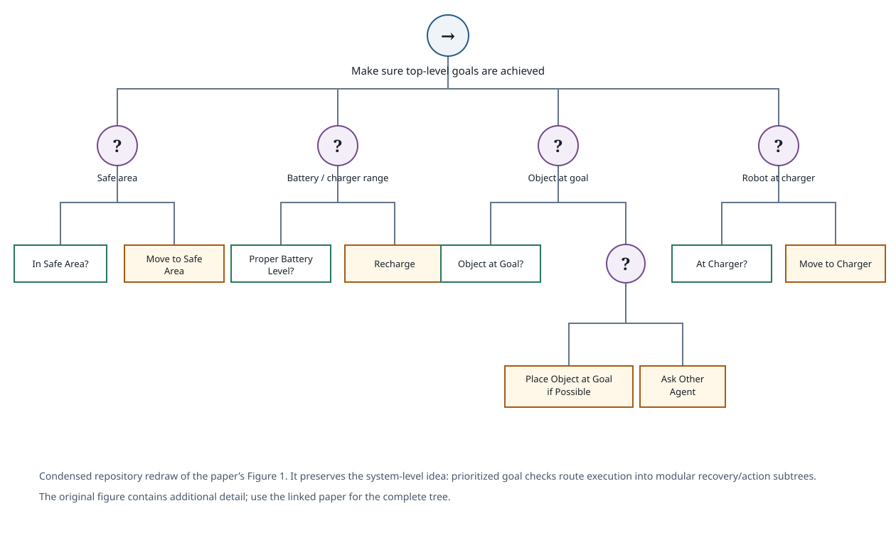
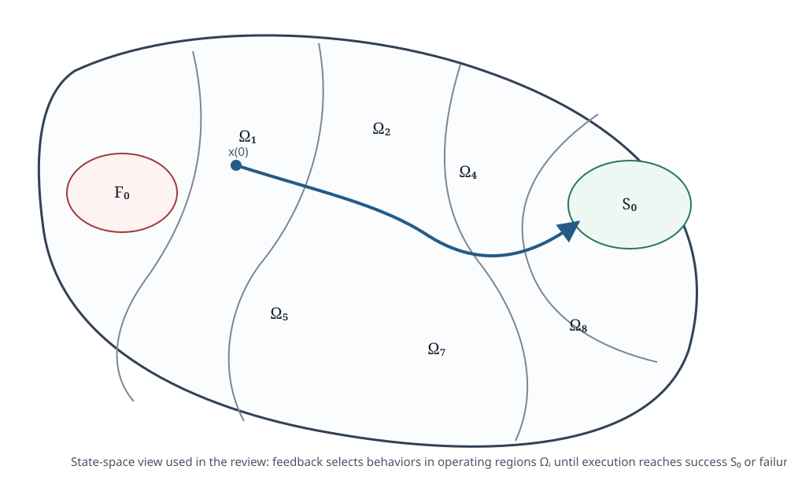
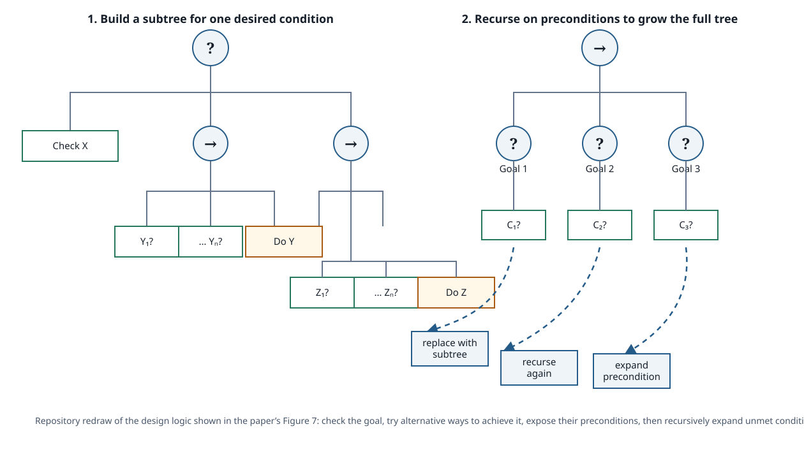

# Ögren & Sprague (2022) — Behavior Trees in Robot Control Systems

## Abstract

Verbatim opening from the paper's abstract:

> “In this paper we will give a control theoretic perspective on the research area of behavior trees in robotics.”

- [Read the complete abstract on arXiv](https://arxiv.org/abs/2203.13083)
- [Version of record at Annual Reviews](https://doi.org/10.1146/annurev-control-042920-095314)

The abstract identifies **modularity, hierarchy, and feedback** as the three ideas used to manage the complexity of versatile robot-control systems. It then states that the review uses those ideas across theoretical analysis, practical design, and extensions that connect BTs with other concepts from control theory and robotics.

## Full text

- [arXiv PDF](https://arxiv.org/pdf/2203.13083)
- [Version of record](https://doi.org/10.1146/annurev-control-042920-095314)

## Control-system overview

*Condensed repository redraw of the paper's Figure 1. The original mobile-manipulator BT has four prioritized top-level goals and substantially more internal detail; this redraw keeps the system-level structure and representative recovery branches.*

The opening example makes the review's argument concrete. A robot controller is organized around prioritized goals such as staying in a safe area, maintaining battery feasibility, moving an object to its goal, and reaching the charger. Each goal can contain lower-level checks and actions while still exposing the same BT interface to its parent.

The figure also motivates explainability: when a leaf action is executing, its path toward the root provides a hierarchy of reasons for why that action is currently selected.

## Contents

1. Introduction
2. History of BTs and their relationship to finite-state machines
3. Definition of behavior trees
4. Optimal modularity
5. Proving convergence
6. A design principle exploiting modularity and feedback
7. Safety and invariance with control barrier functions
8. Explainable AI and human-robot interaction
9. Reinforcement learning, utility, and BTs
10. Evolutionary algorithms and BTs
11. Planning and BTs
12. Conclusions

## Review method and perspective

This is a control-theoretic review rather than a systematic literature search like Iovino et al. The paper develops a single analytical lens across the field: BTs are hierarchical modular controllers whose interfaces carry enough status information to support feedback-based switching at higher levels.

The review moves from definitions and modularity into convergence analysis, then uses that analysis to motivate a recursive design principle. It subsequently connects the same structure to safety through control barrier functions, explainability, learning, evolutionary methods, and planning.

That organization matters because it treats BTs as more than a software notation. The tree is analyzed as a controller that partitions state space, switches among control laws, and repeatedly reevaluates progress and applicability.

## Analysis methodology: operating regions

*Repository redraw of the paper's Figure 2. The review partitions state space into operating regions for subtrees plus global success and failure regions, then studies how execution moves through those regions.*

The formal model associates each BT or subtree with Running, Success, and Failure regions. For a composed tree, the authors define **operating regions** in which a particular subtree supplies the active controller. This turns BT execution into a state-dependent switching system: feedback through return statuses determines which control law is active at each point in the state space.

The analysis then asks whether execution reaches the global success region while avoiding failure or unsafe regions. This framing supports convergence, robustness, safety, and efficiency arguments for larger BTs by reasoning about how properties compose across Sequence and Fallback structures.

## Design workflow: recursive goal expansion

*Repository redraw of the design logic in the paper's Figure 7. A desired condition is checked first; alternative ways to achieve it sit under a Fallback, their preconditions become new conditions, and those conditions can recursively be replaced by subtrees that achieve them.*

The practical workflow is recursive:

1. State a desired condition or goal.
2. Check whether it already holds.
3. If it does not, collect alternative actions that can make it true under a Fallback.
4. Place each action behind the conditions required for that action to be applicable.
5. Replace an unmet precondition with another BT that tries to make that precondition true.
6. Repeat until the required conditions are grounded in checks or executable skills.

This pattern exposes the relationship between modularity and feedback. A subtree only needs to know how to achieve its local condition; its parent decides why that condition matters. The leading condition check also prevents unnecessary action when the goal is already satisfied, while the Fallback gives the controller alternate ways to recover when one method is unavailable or fails.

## Modularity, hierarchy, and feedback

The review's central synthesis is that these three properties reinforce each other:

- **Modularity** isolates behaviors behind common interfaces, supporting independent development, testing, replacement, and reuse.
- **Hierarchy** lets modules contain submodules so that large robot tasks can be decomposed without creating one flat switching structure.
- **Feedback** lets higher-level selection react to whether a subtree is applicable, progressing, successful, or failed rather than committing to a fixed open-loop sequence.

The authors use this perspective to connect BT structure to convergence proofs, invariant and safe sets, control barrier functions, human-readable execution paths, and automated methods for learning or planning tree structure.

## Significance for robot-control research

This paper is especially useful for separating two questions that are often mixed together: **how a BT is represented** and **what guarantees or design principles follow from its execution semantics**. The review shows how Sequence/Fallback composition and return statuses can be interpreted as feedback-driven switching, making it possible to reason about the closed-loop behavior of the overall robot controller.

It also provides a bridge between foundational BT theory and later application papers. Planning, reinforcement learning, evolutionary algorithms, and safety mechanisms appear as extensions or construction methods around a common modular controller interface rather than as competing definitions of a behavior tree.

## Repository notes

This note follows the paper's progression from system overview to analysis method to recursive design workflow. The three local visuals are simplified repository redraws derived from Figures 1, 2, and 7; use the linked full text for the original artwork and complete mathematical detail.

Connections in this knowledge base:

- [Iovino et al. (2022)](iovino-et-al-2022-survey.md) provides the broader literature taxonomy across applications and design methods.
- [Colledanchise & Ögren (2017)](colledanchise-ogren-2017-bt-modularity.md) develops the modularity and hybrid-control foundations that this review extends and synthesizes.
- [Behavior Tree Foundations](../topics/behavior-tree-foundations.md) gives the repository-level comparison with decision trees, finite-state machines, and planners.

## Citation

Petter Ögren and Christopher I. Sprague. **Behavior Trees in Robot Control Systems.** *Annual Review of Control, Robotics, and Autonomous Systems*, 5, 81–107, 2022. DOI: [10.1146/annurev-control-042920-095314](https://doi.org/10.1146/annurev-control-042920-095314).
