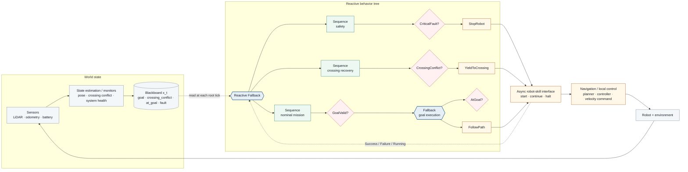
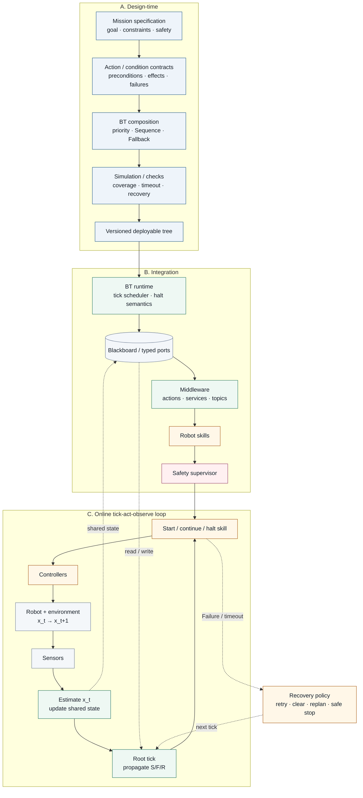

# Behavior Tree Foundations

## What is a behavior tree?

A **Behavior Tree (BT)** is a hierarchical control structure for organizing how an autonomous agent selects, sequences, interrupts, and switches between behaviors. In robotics, a BT is best understood as an **executable task-switching architecture** rather than as a predictive model.

A standard BT is a rooted directed tree. Execution begins at the root and propagates through control-flow nodes toward leaves. Every tick returns a small status interface:

- **Success** — the node's objective or condition is satisfied.
- **Failure** — the node cannot satisfy its objective, or a condition is false.
- **Running** — execution is still in progress.

Two canonical control-flow nodes are:

- **Sequence** — ticks children from left to right; returns `Failure` when the first decisive child fails, `Running` when the first unresolved child is still executing, and `Success` only when all children succeed.
- **Fallback / Selector** — ticks alternatives from left to right; returns `Success` when the first decisive child succeeds, `Running` when the first unresolved child is still executing, and `Failure` only when all children fail.

Leaves are usually **conditions** or **actions**. Implementations may add decorators, parallel nodes, memory, recovery nodes, blackboards/data ports, and application-specific extensions.

### Practical overview: control flow, shared data, and robot skills



*Figure 1. A practical BT embedded in a robot executive. Safety and a dynamic crossing conflict are checked before nominal mission execution. The diagram is declarative Mermaid, so node placement and edge routing are managed automatically.*

A smaller BT might be written as:

```text
Fallback
├── Sequence
│   ├── BatteryLow?
│   └── Recharge
└── Sequence
    ├── GoalAvailable?
    └── NavigateToGoal
```

On each control update the root can re-evaluate whether the higher-priority recharge behavior is applicable. That repeated evaluation is one reason BTs are described as **reactive**: a changed state can alter which subtree is active without an explicit transition from every possible prior behavior.

This formulation was given a rigorous robotics semantics by Marzinotto et al. (2014), and subsequent work by Colledanchise and Ögren connected BT composition to hybrid control, modularity, and other switching structures. The 2022 survey by Iovino et al. provides a broad map of the field.

## The core idea: a tree that runs, not merely a tree that classifies

The visual similarity between a behavior tree and a decision tree is misleading. Both are trees, but their node semantics and purposes are different.

A behavior tree answers a question such as:

> **What should the agent execute now, and what should it try next if conditions or outcomes change?**

A classical machine-learning decision tree answers:

> **Given this feature vector, what class or numeric value should be predicted?**

## Behavior tree vs. machine-learning decision tree

| Dimension | Behavior tree | Decision tree (ML) |
| --- | --- | --- |
| Primary role | Runtime task selection and execution | Prediction: classification or regression |
| Typical input | Current world/robot state plus child execution status | A feature vector for one sample |
| Internal nodes | Control-flow operators and/or conditions | Feature tests / split rules |
| Leaves | Conditions and executable actions/subtrees | Predicted class, probability, or numeric value |
| Return/output | Usually `Success`, `Failure`, or `Running`; actions may have side effects | A prediction |
| Time | Repeated evaluation during execution | Usually one root-to-leaf inference per sample |
| Reactivity | High-level choices can be reconsidered as state changes | A new prediction requires another inference call |
| State/progress | `Running` explicitly represents incomplete execution | Standard prediction trees do not represent an executing action |
| Construction | Engineered, synthesized, learned, or hybrid | Commonly induced from labeled data |
| Main quality concerns | Modularity, reactivity, robustness, safety, task correctness | Generalization, predictive accuracy, calibration, interpretability |

### Why `Running` matters

An action such as `FollowPath` may require seconds or minutes. A BT can return `Running`, be ticked again later, and allow higher-level logic to decide whether that action should continue, be interrupted, or be replaced by another behavior.

A standard classifier decision tree has no analogous notion of an action that remains in progress.

### Why repeated evaluation matters

A BT is normally embedded in a control loop. Conditions are checked again as the environment changes. If a higher-priority condition becomes true, a **reactive** control-flow node can switch to that branch on the next tick. A previously running lower-priority action is then halted according to the implementation's interruption semantics.

### Simulated execution scenario: warehouse crossing conflict

The example below is not a sequence of hand-authored animation frames. It runs a small deterministic two-dimensional simulator in the browser. Static shelves define the map, **A\*** generates a collision-free nominal path, the robot follows that path with a simple differential-drive controller, and a pallet truck moves independently across the aisle. The crossing condition is computed from the simulated geometry. The same simulation state feeds the blackboard, BT evaluator, robot motion, and status display.

```kb-sim
{
  "title": "Simulated warehouse navigation with reactive yielding",
  "loop": true,
  "world": {
    "width": 12,
    "height": 8,
    "goal": {"x": 10.8, "y": 2.2, "label": "inspection goal"},
    "obstacles": [
      {"x": 0.6, "y": 0.6, "w": 2.0, "h": 1.15},
      {"x": 3.4, "y": 0.6, "w": 2.0, "h": 1.15},
      {"x": 6.2, "y": 0.6, "w": 2.0, "h": 1.15},
      {"x": 9.0, "y": 0.6, "w": 2.0, "h": 1.15},
      {"x": 0.6, "y": 6.25, "w": 2.0, "h": 1.15},
      {"x": 3.4, "y": 6.25, "w": 2.0, "h": 1.15},
      {"x": 6.2, "y": 6.25, "w": 2.0, "h": 1.15},
      {"x": 9.0, "y": 6.25, "w": 2.0, "h": 1.15},
      {"x": 7.2, "y": 3.25, "w": 1.15, "h": 1.2}
    ]
  },
  "robot": {
    "x": 1.2,
    "y": 5.1,
    "theta": -0.12,
    "radius": 0.26,
    "maxLinear": 0.8,
    "maxAngular": 1.8
  },
  "dynamicObstacle": {
    "x": 5.4,
    "yMin": 1.2,
    "yMax": 6.8,
    "speed": 0.52,
    "radius": 0.38,
    "label": "pallet truck"
  },
  "control": {
    "dt": 0.05,
    "btHz": 10,
    "sensorRange": 1.35,
    "goalTolerance": 0.34,
    "cellSize": 0.38,
    "waypointTolerance": 0.32,
    "resetDelay": 2.5
  },
  "tree": {
    "id": "root",
    "label": "Reactive Fallback",
    "kind": "fallback",
    "children": [
      {
        "id": "safety",
        "label": "Sequence: safety",
        "kind": "sequence",
        "children": [
          {"id": "fault", "label": "CriticalFault?", "kind": "condition", "condition": "criticalFault"},
          {"id": "stop", "label": "StopRobot", "kind": "action", "action": "stopRobot"}
        ]
      },
      {
        "id": "crossing",
        "label": "Sequence: crossing recovery",
        "kind": "sequence",
        "children": [
          {"id": "conflict", "label": "CrossingConflict?", "kind": "condition", "condition": "crossingConflict"},
          {"id": "yield", "label": "YieldToCrossing", "kind": "action", "action": "yieldToCrossing"}
        ]
      },
      {
        "id": "mission",
        "label": "Sequence: mission",
        "kind": "sequence",
        "children": [
          {"id": "goalValid", "label": "GoalValid?", "kind": "condition", "condition": "goalValid"},
          {
            "id": "goalExec",
            "label": "Fallback: goal execution",
            "kind": "fallback",
            "children": [
              {"id": "atGoal", "label": "AtGoal?", "kind": "condition", "condition": "atGoal"},
              {"id": "follow", "label": "FollowPath", "kind": "action", "action": "followPath"}
            ]
          }
        ]
      }
    ]
  }
}
```

*Simulation 1. The scene is generated from a world model, not drawn as a timeline. A* plans around the static shelf geometry. The robot and pallet truck are advanced by the simulator, crossing conflict is computed from their relative geometry, and the BT is evaluated at 10 Hz. `Play/Pause`, `Step`, and `Reset` operate on the simulator itself.*

The practical consequence is important: the visualization cannot claim that a node is `Running`, `Failure`, or `Success` merely because an animation author assigned that label. The displayed status is the result of evaluating the tree against the current simulated blackboard.

In this particular scenario the recovery action is **yielding**, not a fictitious local planner. When the pallet truck enters the robot's conflict range, `CrossingConflict?` succeeds and `YieldToCrossing` returns `Running`, producing zero commanded velocity. When the truck clears, the crossing sequence fails at its condition on the next root tick, the reactive fallback proceeds to the mission branch, and `FollowPath` resumes.

## Formal relationship: decision trees can be represented inside the BT formalism

The two structures are not unrelated. Colledanchise and Ögren (2017) show that BTs can generalize several switching structures, including decision trees. A decision-tree branch can be represented using BT conditions and control-flow composition, while BTs additionally provide execution semantics such as `Running`, repeated ticks, and hierarchical behavior composition.

> A decision tree can be encoded as a restricted behavior-selection structure, but a general behavior tree is not merely a decision tree with different labels.

## From task specification to deployed behavior

A BT is not only a tree representation; in a robotics system it sits inside a repeated engineering and execution loop. Goals and failure modes are converted into conditions/actions, those leaves are composed into prioritized subtrees, the tree is integrated with robot skills and shared state, and repeated ticks close the feedback loop between the controller and the environment.



*Figure 2. A compact engineering workflow. Mermaid manages the three lanes and their dependencies automatically. The online loop repeatedly maps current state `x_t` through the BT to an active skill, changes the environment, observes `x_{t+1}`, and can enter an explicit recovery policy after a skill failure or timeout.*

Implementation details matter. Blackboard/data-port semantics, action halting, middleware callbacks, and failure recovery determine how the abstract tree interacts with a physical robot and asynchronous processes.

## Behavior trees vs. nearby autonomy architectures

### Finite-state machines (FSMs)

FSMs represent behavior using explicit states and transitions. They are effective and mathematically well understood, but large reactive controllers can accumulate many transitions between states. BTs move much of that switching logic into reusable hierarchical control-flow composition. BTs and FSMs are not opposites; systems often combine them.

### Hierarchical task networks (HTNs) and planners

HTNs and task planners primarily address **how to decompose or generate a plan**. A BT primarily addresses **how to execute and react while carrying out behavior**. Planning systems can generate BTs, and BTs can call planning components as actions. In autonomy stacks, planning and behavior execution are often complementary layers.

## A useful mental model

For this knowledge base:

- A **decision tree** is primarily a *prediction/decision rule over data*.
- A **behavior tree** is primarily an *execution and task-switching structure over behaviors*.
- The shared tree shape expresses hierarchical decomposition, but **node semantics, temporal behavior, and purpose** are different.

## Terminology caveat

"Decision tree" is also used outside machine learning for decision analysis, where chance nodes, decisions, utilities, and sequential choices may be represented in a tree. Those models still do not automatically acquire the tick/status/action semantics of robotics BTs.

## Recommended starting sources

1. Marzinotto, A., Colledanchise, M., Smith, C., & Ögren, P. (2014). **Towards a Unified Behavior Trees Framework for Robot Control.** *IEEE International Conference on Robotics and Automation (ICRA)*, 5420–5427. DOI: [10.1109/ICRA.2014.6907656](https://doi.org/10.1109/ICRA.2014.6907656). [KTH accepted version](https://kth.diva-portal.org/smash/get/diva2:808739/FULLTEXT01).
2. Colledanchise, M., & Ögren, P. (2017). **How Behavior Trees Modularize Hybrid Control Systems and Generalize Sequential Behavior Compositions, the Subsumption Architecture, and Decision Trees.** *IEEE Transactions on Robotics*, 33(2), 372–389. DOI: [10.1109/TRO.2016.2633567](https://doi.org/10.1109/TRO.2016.2633567). [KTH accepted version](https://www.diva-portal.org/smash/get/diva2:1078931/FULLTEXT01.pdf).
3. Iovino, M., Scukins, E., Styrud, J., Ögren, P., & Smith, C. (2022). **A Survey of Behavior Trees in Robotics and AI.** *Robotics and Autonomous Systems*, 154, 104096. DOI: [10.1016/j.robot.2022.104096](https://doi.org/10.1016/j.robot.2022.104096). [arXiv:2005.05842](https://arxiv.org/abs/2005.05842).
4. Ögren, P., & Sprague, C. I. (2022). **Behavior Trees in Robot Control Systems.** *Annual Review of Control, Robotics, and Autonomous Systems*, 5, 81–107. DOI: [10.1146/annurev-control-042920-095314](https://doi.org/10.1146/annurev-control-042920-095314). [arXiv:2203.13083](https://arxiv.org/abs/2203.13083).
5. Colledanchise, M., & Ögren, P. (2018). **Behavior Trees in Robotics and AI: An Introduction.** CRC Press. DOI: [10.1201/9780429489105](https://doi.org/10.1201/9780429489105). [Author-maintained book site](https://btirai.github.io/) and [preprint](https://arxiv.org/abs/1709.00084).
6. Quinlan, J. R. (1986). **Induction of Decision Trees.** *Machine Learning*, 1, 81–106. DOI: [10.1007/BF00116251](https://doi.org/10.1007/BF00116251).
7. Breiman, L., Friedman, J. H., Olshen, R. A., & Stone, C. J. (1984). **Classification and Regression Trees.** Wadsworth & Brooks/Cole. [Publisher page](https://www.routledge.com/Classification-and-Regression-Trees/Breiman-Friedman-Stone-Olshen/p/book/9780412048418).

## Next questions for the knowledge base

The natural follow-on topics are precise tick semantics, reactive vs. memory variants, BTs vs. FSMs and statecharts, planning-to-BT compilation, and formal treatment of safety and robustness in BT composition.
