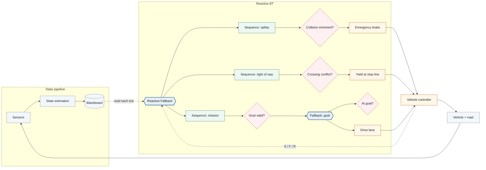
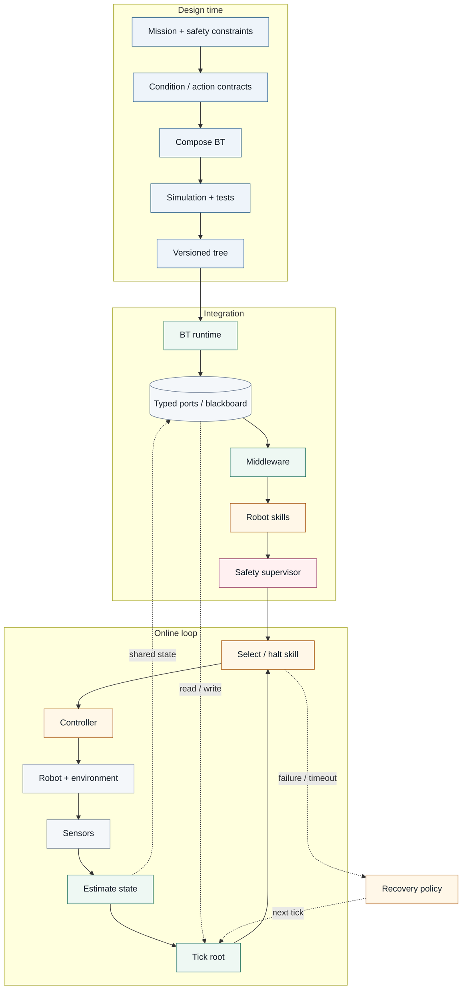

# Behavior Tree Foundations

## What is a behavior tree?

A **Behavior Tree (BT)** is a hierarchical execution model for selecting, sequencing, interrupting, and switching between behaviors. In robotics and autonomous systems, a BT is best understood as an **executable control architecture** rather than a prediction model.

A standard BT is a rooted directed tree. The root is ticked repeatedly. Control-flow nodes propagate each tick toward conditions and actions, and nodes return one of three canonical statuses:

- **Success** — the condition is true or the action has completed its objective.
- **Failure** — the condition is false or the action cannot complete its objective.
- **Running** — execution is still in progress.

Two core control-flow nodes are:

- **Sequence** — ticks children from left to right; it stops on the first `Failure` or `Running`, and returns `Success` only when all children succeed.
- **Fallback / Selector** — ticks alternatives from left to right; it stops on the first `Success` or `Running`, and returns `Failure` only when all children fail.

Leaves are generally **conditions** that query state and **actions** that affect the robot, environment, or internal system.

### Practical overview: state, control flow, and robot skills



*Figure 1. A practical BT inside an autonomous-vehicle control loop. The diagram is declarative Mermaid; layout and edge routing are generated automatically. Use the diagram toolbar to zoom, pan, and refit the view.*

## The core idea: a tree that runs

The visual similarity between a behavior tree and a machine-learning decision tree is misleading. A BT manages ongoing execution and can reconsider higher-priority conditions every tick. A classical decision tree maps an input feature vector to a prediction.

| Dimension | Behavior tree | Decision tree (ML) |
| --- | --- | --- |
| Primary role | Runtime execution and task switching | Classification or regression |
| Internal nodes | Control-flow operators and conditions | Feature tests |
| Leaves | Conditions, actions, or subtrees | Predictions |
| Output | `Success`, `Failure`, `Running` | Class, probability, or value |
| Time | Repeated ticks during execution | Usually one inference per sample |
| Reactivity | Can interrupt lower-priority running behavior | Requires another inference call |
| Construction | Engineered, synthesized, learned, or hybrid | Usually induced from data |

### Why `Running` matters

Physical actions take time. `DriveLane`, `NavigateToGoal`, or `DockAndCharge` can remain `Running` over many ticks. A reactive parent can still reconsider higher-priority conditions and interrupt the action when the world changes.

### Why repeated evaluation matters

Repeated root ticks make the tree part of the closed-loop controller. Conditions are recomputed from current state rather than from the state that existed when an action first began.

## Simulated execution scenario: unsignalized road crossing

The visualization below is a **small deterministic road simulator**, not a hand-authored animation. The ego car and cross-traffic car are both advanced from their current simulated positions. The BT is evaluated at 10 Hz. A predicted intersection-arrival conflict activates the yielding branch; otherwise the ego vehicle continues along its lane.

The right side is a live D3-laid behavior tree. Its node states come directly from the evaluator used to control the vehicle.

```kb-sim
{
  "title": "Road intersection: reactive yielding and resume",
  "loop": true,
  "road": {
    "width": 120,
    "height": 80,
    "mainY": 40,
    "crossX": 60,
    "laneWidth": 10,
    "intersectionHalf": 7,
    "stopLineX": 49,
    "goalX": 108
  },
  "ego": {
    "x": 12,
    "y": 42.5,
    "speed": 6.2,
    "length": 4.4,
    "width": 1.9,
    "maxSpeed": 9,
    "accel": 2,
    "comfortBrake": 3.4,
    "emergencyBrake": 7
  },
  "crossTraffic": {
    "x": 62.5,
    "y": 72,
    "speed": 5,
    "resetY": 74,
    "exitY": 5,
    "length": 4.6,
    "width": 2,
    "label": "cross traffic"
  },
  "control": {
    "dt": 0.04,
    "btHz": 10,
    "conflictHorizon": 2.4,
    "approachStartX": 25,
    "goalTolerance": 1.2,
    "resetDelay": 2.5
  },
  "tree": {
    "id": "root",
    "label": "Reactive Fallback",
    "kind": "fallback",
    "children": [
      {
        "id": "safety",
        "label": "Sequence: safety",
        "kind": "sequence",
        "children": [
          {
            "id": "risk",
            "label": "Collision imminent?",
            "kind": "condition",
            "condition": "collisionImminent"
          },
          {
            "id": "ebrake",
            "label": "EmergencyBrake",
            "kind": "action",
            "action": "emergencyBrake"
          }
        ]
      },
      {
        "id": "rightOfWay",
        "label": "Sequence: right of way",
        "kind": "sequence",
        "children": [
          {
            "id": "conflict",
            "label": "CrossingConflict?",
            "kind": "condition",
            "condition": "crossingConflict"
          },
          {
            "id": "yield",
            "label": "YieldAtStopLine",
            "kind": "action",
            "action": "yieldAtStopLine"
          }
        ]
      },
      {
        "id": "mission",
        "label": "Sequence: mission",
        "kind": "sequence",
        "children": [
          {
            "id": "goalValid",
            "label": "GoalValid?",
            "kind": "condition",
            "condition": "goalValid"
          },
          {
            "id": "goalExec",
            "label": "Fallback: goal",
            "kind": "fallback",
            "children": [
              {
                "id": "atGoal",
                "label": "AtGoal?",
                "kind": "condition",
                "condition": "atGoal"
              },
              {
                "id": "drive",
                "label": "DriveLane",
                "kind": "action",
                "action": "driveLane"
              }
            ]
          }
        ]
      }
    ]
  }
}
```

*Simulation 1. The ego car accelerates and advances whenever `DriveLane` is active. Cross traffic moves independently. When the predicted arrival windows overlap near the intersection, `CrossingConflict?` succeeds and `YieldAtStopLine` brakes the ego car toward the yield line. Once the crossing car clears, the higher-priority sequence fails at its condition and the mission branch becomes active again. `Play/Pause`, `Step`, and `Reset` operate on the simulation itself.*

This example demonstrates an important BT property: there is no explicit `Drive → Yield → Drive` transition graph. The switch emerges from reevaluating the same priority structure against new state.

## Formal relationship to other tree structures

Colledanchise and Ögren show that BT composition can represent or generalize several switching structures. A conventional decision-tree branch can be represented with BT conditions and control-flow composition, while a general BT additionally includes repeated execution and `Running` semantics.

> A decision tree can be embedded as a restricted decision structure, but a general behavior tree is not simply a classifier tree with different labels.

## From task specification to deployed behavior



*Figure 2. Design, integration, and online execution are distinct but connected. The online loop repeatedly maps current state through the BT to an active skill and then observes the resulting next state. The Mermaid viewer can be zoomed and panned when the full workflow is too dense for the available reader width.*

## Behavior trees vs. nearby autonomy architectures

### Finite-state machines

FSMs express explicit states and transitions. BTs instead place much of the switching logic in hierarchical control-flow composition. Large systems frequently combine both representations.

### Planners and hierarchical task networks

Planners primarily generate or decompose plans. BTs primarily execute behavior and react during execution. A planner can generate a BT, a BT can invoke a planner, and both can coexist in an autonomy stack.

## A useful mental model

- A **decision tree** is primarily a prediction or decision rule over data.
- A **behavior tree** is primarily an execution and task-switching structure over behaviors.
- A **planner** primarily searches for actions or task decompositions that achieve a goal.
- A production autonomy stack may contain all three.

## Recommended starting sources

1. Marzinotto, A., Colledanchise, M., Smith, C., & Ögren, P. (2014). **Towards a Unified Behavior Trees Framework for Robot Control.** *IEEE International Conference on Robotics and Automation (ICRA)*, 5420–5427. DOI: [10.1109/ICRA.2014.6907656](https://doi.org/10.1109/ICRA.2014.6907656). [KTH accepted version](https://kth.diva-portal.org/smash/get/diva2:808739/FULLTEXT01).
2. Colledanchise, M., & Ögren, P. (2017). **How Behavior Trees Modularize Hybrid Control Systems and Generalize Sequential Behavior Compositions, the Subsumption Architecture, and Decision Trees.** *IEEE Transactions on Robotics*, 33(2), 372–389. DOI: [10.1109/TRO.2016.2633567](https://doi.org/10.1109/TRO.2016.2633567).
3. Iovino, M., Scukins, E., Styrud, J., Ögren, P., & Smith, C. (2022). **A Survey of Behavior Trees in Robotics and AI.** *Robotics and Autonomous Systems*, 154, 104096. DOI: [10.1016/j.robot.2022.104096](https://doi.org/10.1016/j.robot.2022.104096). [arXiv:2005.05842](https://arxiv.org/abs/2005.05842).
4. Ögren, P., & Sprague, C. I. (2022). **Behavior Trees in Robot Control Systems.** *Annual Review of Control, Robotics, and Autonomous Systems*, 5, 81–107. DOI: [10.1146/annurev-control-042920-095314](https://doi.org/10.1146/annurev-control-042920-095314). [arXiv:2203.13083](https://arxiv.org/abs/2203.13083).
5. Colledanchise, M., & Ögren, P. (2018). **Behavior Trees in Robotics and AI: An Introduction.** CRC Press. DOI: [10.1201/9780429489105](https://doi.org/10.1201/9780429489105). [Preprint](https://arxiv.org/abs/1709.00084).
6. Quinlan, J. R. (1986). **Induction of Decision Trees.** *Machine Learning*, 1, 81–106. DOI: [10.1007/BF00116251](https://doi.org/10.1007/BF00116251).

## Next questions for the knowledge base

Natural follow-on topics are precise tick semantics, reactive versus memory variants, interruption and halt semantics, BTs versus statecharts, planning-to-BT compilation, and formal treatment of safety and robustness.
