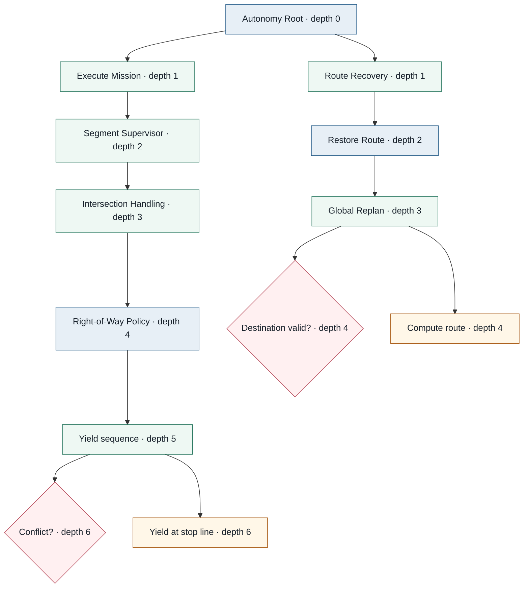
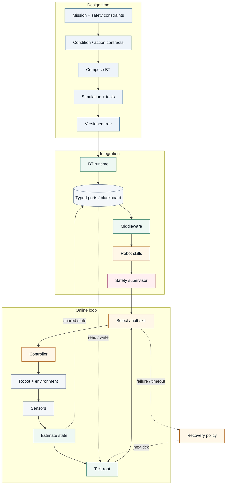

# Behavior Tree Foundations

## What is a behavior tree?

A **Behavior Tree (BT)** is a hierarchical execution model for selecting, sequencing, interrupting, and switching between behaviors. In robotics and autonomous systems, a BT is best understood as an **executable control architecture** rather than a prediction model.

A standard BT is a rooted directed tree. The root is ticked repeatedly. Control-flow nodes propagate each tick toward conditions and actions, and nodes return one of three canonical statuses:

- **Success** — the condition is true or the action has completed its objective.
- **Failure** — the condition is false or the action cannot complete its objective.
- **Running** — execution is still in progress.

Two core control-flow nodes are:

- **Sequence** — ticks children from left to right; it stops on the first `Failure` or `Running`, and returns `Success` only when all children succeed.
- **Fallback / Selector** — ticks alternatives from left to right; it stops on the first `Success` or `Running`, and returns `Failure` only when all children fail.

Leaves are generally **conditions** that query state and **actions** that affect the robot, environment, or internal system.

### Practical overview: planning, state, control flow, and robot skills

```mermaid
flowchart LR
  MAP["City road network"] --> PLAN["A* global planner"]
  PLAN --> ROUTE["Route"]
  ROUTE --> BB[("Blackboard")]

  WORLD["World state"] --> PER["Perception"]
  PER --> BB

  BB --> ROOT{{"Behavior tree"}}
  ROOT --> ACT["Selected behavior"]
  ACT --> CTRL["Vehicle controller"]
  CTRL --> EGO["Ego vehicle"]
  EGO --> WORLD

  classDef control fill:#e7eff6,stroke:#245b88,color:#17202a,stroke-width:2px;
  classDef action fill:#fff7e8,stroke:#a95a13,color:#17202a;
  classDef data fill:#f4f7fa,stroke:#718096,color:#17202a;
  classDef plan fill:#eef8f3,stroke:#28775f,color:#17202a;

  class ROOT control;
  class ACT,CTRL action;
  class MAP,ROUTE,WORLD,PER,BB,EGO data;
  class PLAN plan;
```



*Figure 1. The simulator uses one closed-loop state chain. The map produces a road graph, A* produces the displayed route, perception populates the blackboard, the BT selects a driving behavior, and the controller updates the physical world.*

## The core idea: a tree that runs

The visual similarity between a behavior tree and a machine-learning decision tree is misleading. A BT manages ongoing execution and can reconsider higher-priority conditions every tick. A classical decision tree maps an input feature vector to a prediction.

| Dimension | Behavior tree | Decision tree (ML) |
| --- | --- | --- |
| Primary role | Runtime execution and task switching | Classification or regression |
| Internal nodes | Control-flow operators and conditions | Feature tests |
| Leaves | Conditions, actions, or subtrees | Predictions |
| Output | `Success`, `Failure`, `Running` | Class, probability, or value |
| Time | Repeated ticks during execution | Usually one inference per sample |
| Reactivity | Can interrupt lower-priority running behavior | Requires another inference call |
| Construction | Engineered, synthesized, learned, or hybrid | Usually induced from data |

### Why `Running` matters

Physical actions take time. `DriveSegment`, `FollowLeadVehicle`, or `YieldAtStopLine` can remain `Running` over many ticks. A reactive parent can still reconsider higher-priority conditions and interrupt the action when the world changes. The live simulator also records `HALTED` when a previously running action is preempted and leaves unticked branches `IDLE`.

### Why repeated evaluation matters

Repeated root ticks make the tree part of the closed-loop controller. Conditions are recomputed from current perception and planner state rather than from the state that existed when an action first began.

## Behavior Trees can be deeply hierarchical

There is no fixed depth of three. A BT is recursively composed, so useful branches can be as deep as the task decomposition requires. Depth is not a goal by itself: each level should answer a distinct control question.



Mission, navigation, segment handling, intersection handling, right-of-way policy, and physical action are different concerns. The evaluator therefore recurses over arbitrary tree depth rather than using depth-specific logic.

A node is represented as structured data, not as a manually drawn box. For example:

```json
{
  "id": "intersection-policy",
  "label": "Intersection Policy",
  "kind": "fallback",
  "children": [
    {
      "id": "yield-sequence",
      "label": "Yield",
      "kind": "sequence",
      "children": [
        {
          "id": "intersection-conflict",
          "label": "Conflict?",
          "kind": "condition",
          "condition": "intersectionConflict"
        },
        {
          "id": "yield-stop-line",
          "label": "YieldAtStopLine",
          "kind": "action",
          "action": "yieldAtStopLine"
        }
      ]
    }
  ]
}
```

The same data drives both recursive evaluation and the D3 hierarchy shown in the live panel.

## Simulated execution scenario: small-city navigation mission

The visualization below is a **deterministic city-road simulator**, not a sequence of authored frames. The map contains four avenues, five streets, twelve building blocks, twenty intersection nodes, and planner edges generated from the road geometry. The ego vehicle starts in the south-west and must reach a loading point in the north-east.

At initialization there is no route. The BT discovers this state and invokes A*. The planned route is then executed segment by segment. A slower lead vehicle, a pedestrian crossing, cross traffic, and a construction closure are world events; none of them directly assigns a BT node state. The BT sees their consequences through perception and the blackboard.

The construction closure is deliberately placed on an upcoming edge of route version 1. When it activates, route validation fails and the recovery branch invokes A* again. Route version 2 takes a visibly different path through the north-east part of the grid.

```kb-sim
{
  "title": "Small city: planning, reactive driving, recovery, and goal completion",
  "loop": true,
  "city": {
    "width": 168,
    "height": 126,
    "roadWidth": 10,
    "verticalXs": [12, 48, 84, 120, 156],
    "horizontalYs": [15, 47, 79, 111],
    "verticalNames": ["1st Street", "2nd Street", "3rd Street", "4th Street", "5th Street"],
    "horizontalNames": ["Avenue A", "Avenue B", "Avenue C", "Avenue D"]
  },
  "startNode": "r3c0",
  "goalNode": "r0c4",
  "planner": {
    "turnPenalty": 2,
    "edgePenalties": {
      "h3-2-3": 28,
      "h3-3-4": 28,
      "v0-0-1": 20,
      "v0-1-2": 20,
      "v0-2-3": 20,
      "v1-0-1": 16,
      "v1-1-2": 16,
      "v1-2-3": 16,
      "h2-2-3": 10,
      "h2-3-4": 10,
      "v2-0-1": 40
    }
  },
  "events": {
    "pedestrianStart": 17,
    "pedestrianEnd": 23,
    "pedestrianNode": "r2c2",
    "closureTime": 28,
    "closureEdge": "h1-3-4",
    "crossStart": 43,
    "crossEnd": 51,
    "crossNode": "r0c3"
  },
  "ego": {
    "length": 4.5,
    "width": 2,
    "maxSpeed": 7,
    "accel": 2.1,
    "comfortBrake": 3.2,
    "emergencyBrake": 7.5,
    "turnRate": 2.4
  },
  "control": {
    "dt": 0.04,
    "btHz": 10,
    "goalTolerance": 1.4,
    "intersectionRange": 15,
    "conflictHorizon": 2.4,
    "leadRange": 17,
    "safeFollowingDistance": 8,
    "plannerTicks": 2,
    "resetDelay": 3
  },
  "tree": {
    "id": "root",
    "label": "Autonomy Root",
    "kind": "fallback",
    "purpose": "Re-evaluate safety, recovery, mission execution, and terminal failure in priority order every tick.",
    "children": [
      {
        "id": "emergency-safety",
        "label": "Emergency Safety",
        "kind": "sequence",
        "children": [
          {
            "id": "collision-imminent",
            "label": "Collision imminent?",
            "kind": "condition",
            "condition": "collisionImminent",
            "reads": ["collision_imminent"],
            "purpose": "Gate the highest-priority emergency braking behavior."
          },
          {
            "id": "emergency-brake",
            "label": "Emergency Brake",
            "kind": "action",
            "action": "emergencyBrake",
            "reads": ["ego_speed"],
            "writes": ["target_speed", "active_skill"],
            "purpose": "Command zero target speed with emergency deceleration."
          }
        ]
      },
      {
        "id": "pedestrian-safety",
        "label": "Pedestrian Safety",
        "kind": "sequence",
        "children": [
          {
            "id": "pedestrian-in-lane",
            "label": "Pedestrian in lane?",
            "kind": "condition",
            "condition": "pedestrianInLane",
            "reads": ["pedestrian_in_lane"]
          },
          {
            "id": "stop-pedestrian",
            "label": "Stop for pedestrian",
            "kind": "action",
            "action": "stopForPedestrian",
            "reads": ["pedestrian_in_lane", "ego_speed"],
            "writes": ["target_speed", "active_skill"],
            "purpose": "Stop the ego vehicle until the pedestrian clears the lane."
          }
        ]
      },
      {
        "id": "destination-complete",
        "label": "Destination Complete",
        "kind": "sequence",
        "children": [
          {
            "id": "destination-reached",
            "label": "Destination reached?",
            "kind": "condition",
            "condition": "destinationReached",
            "reads": ["destination_reached"]
          },
          {
            "id": "stop-destination",
            "label": "Stop at destination",
            "kind": "action",
            "action": "stopAtDestination",
            "reads": ["ego_speed"],
            "writes": ["target_speed", "active_skill"],
            "purpose": "Bring the vehicle to rest and complete the mission."
          }
        ]
      },
      {
        "id": "route-recovery",
        "label": "Route Recovery",
        "kind": "sequence",
        "children": [
          {
            "id": "route-invalid",
            "label": "Route invalid?",
            "kind": "condition",
            "condition": "routeInvalid",
            "reads": ["route_available", "route_valid"]
          },
          {
            "id": "restore-route",
            "label": "Restore Route",
            "kind": "fallback",
            "children": [
              {
                "id": "local-detour",
                "label": "Local Detour",
                "kind": "sequence",
                "children": [
                  {
                    "id": "local-detour-available",
                    "label": "Local detour?",
                    "kind": "condition",
                    "condition": "localDetourAvailable",
                    "reads": ["local_detour_available"]
                  },
                  {
                    "id": "apply-local-detour",
                    "label": "Apply local detour",
                    "kind": "action",
                    "action": "applyLocalDetour"
                  }
                ]
              },
              {
                "id": "global-replan",
                "label": "Global Replan",
                "kind": "sequence",
                "children": [
                  {
                    "id": "destination-valid",
                    "label": "Destination valid?",
                    "kind": "condition",
                    "condition": "destinationValid",
                    "reads": ["destination_valid"]
                  },
                  {
                    "id": "compute-global-route",
                    "label": "Compute global route",
                    "kind": "action",
                    "action": "computeGlobalRoute",
                    "reads": ["route_valid", "blocked_segment", "destination_valid"],
                    "writes": ["route_version", "route_valid", "current_segment"],
                    "purpose": "Run A* on the current road graph and commit the resulting route to mission state."
                  }
                ]
              }
            ]
          }
        ]
      },
      {
        "id": "execute-mission",
        "label": "Execute Mission",
        "kind": "sequence",
        "children": [
          {
            "id": "route-available",
            "label": "Route available?",
            "kind": "condition",
            "condition": "routeAvailable",
            "reads": ["route_available"]
          },
          {
            "id": "segment-supervisor",
            "label": "Segment Supervisor",
            "kind": "fallback",
            "children": [
              {
                "id": "intersection-handling",
                "label": "Intersection Handling",
                "kind": "sequence",
                "children": [
                  {
                    "id": "approaching-intersection",
                    "label": "Approaching intersection?",
                    "kind": "condition",
                    "condition": "approachingIntersection",
                    "reads": ["approaching_intersection"]
                  },
                  {
                    "id": "intersection-policy",
                    "label": "Intersection Policy",
                    "kind": "fallback",
                    "children": [
                      {
                        "id": "yield-sequence",
                        "label": "Yield",
                        "kind": "sequence",
                        "children": [
                          {
                            "id": "intersection-conflict",
                            "label": "Conflict?",
                            "kind": "condition",
                            "condition": "intersectionConflict",
                            "reads": ["intersection_conflict"]
                          },
                          {
                            "id": "yield-stop-line",
                            "label": "Yield at stop line",
                            "kind": "action",
                            "action": "yieldAtStopLine",
                            "reads": ["intersection_conflict", "ego_speed"],
                            "writes": ["target_speed", "active_skill"],
                            "purpose": "Hold before the intersection until cross traffic no longer conflicts."
                          }
                        ]
                      },
                      {
                        "id": "proceed-sequence",
                        "label": "Proceed",
                        "kind": "sequence",
                        "children": [
                          {
                            "id": "proceed-intersection",
                            "label": "Proceed through intersection",
                            "kind": "action",
                            "action": "proceedThroughIntersection",
                            "reads": ["current_segment", "has_right_of_way"],
                            "writes": ["target_speed", "active_skill"]
                          },
                          {
                            "id": "advance-after-intersection",
                            "label": "Advance segment",
                            "kind": "action",
                            "action": "advanceRouteSegment",
                            "writes": ["current_segment"]
                          }
                        ]
                      }
                    ]
                  }
                ]
              },
              {
                "id": "lead-vehicle-handling",
                "label": "Lead Vehicle Handling",
                "kind": "sequence",
                "children": [
                  {
                    "id": "lead-too-close",
                    "label": "Lead vehicle too close?",
                    "kind": "condition",
                    "condition": "leadVehicleTooClose",
                    "reads": ["lead_vehicle_detected", "lead_vehicle_distance"]
                  },
                  {
                    "id": "follow-lead",
                    "label": "Follow lead vehicle",
                    "kind": "action",
                    "action": "followLeadVehicle",
                    "reads": ["lead_vehicle_speed", "lead_vehicle_distance"],
                    "writes": ["target_speed", "active_skill"]
                  },
                  {
                    "id": "advance-after-follow",
                    "label": "Advance segment",
                    "kind": "action",
                    "action": "advanceRouteSegment",
                    "writes": ["current_segment"]
                  }
                ]
              },
              {
                "id": "nominal-road",
                "label": "Nominal Road Execution",
                "kind": "sequence",
                "children": [
                  {
                    "id": "current-segment-valid",
                    "label": "Segment valid?",
                    "kind": "condition",
                    "condition": "currentSegmentValid",
                    "reads": ["route_valid", "current_segment"]
                  },
                  {
                    "id": "maneuver",
                    "label": "Maneuver",
                    "kind": "fallback",
                    "children": [
                      {
                        "id": "turn-sequence",
                        "label": "Turn",
                        "kind": "sequence",
                        "children": [
                          {
                            "id": "turn-required",
                            "label": "Turn required?",
                            "kind": "condition",
                            "condition": "turnRequired",
                            "reads": ["current_segment"]
                          },
                          {
                            "id": "execute-turn",
                            "label": "Execute turn",
                            "kind": "action",
                            "action": "executeTurn",
                            "reads": ["current_segment", "ego_speed"],
                            "writes": ["target_speed", "active_skill"]
                          }
                        ]
                      },
                      {
                        "id": "drive-segment",
                        "label": "Drive segment",
                        "kind": "action",
                        "action": "driveSegment",
                        "reads": ["current_segment", "route_valid"],
                        "writes": ["target_speed", "active_skill"],
                        "purpose": "Track the active road segment at its speed limit when no higher-priority behavior applies."
                      }
                    ]
                  },
                  {
                    "id": "advance-route-segment",
                    "label": "Advance segment",
                    "kind": "action",
                    "action": "advanceRouteSegment",
                    "writes": ["current_segment"]
                  }
                ]
              }
            ]
          }
        ]
      },
      {
        "id": "mission-failure",
        "label": "Mission Failure",
        "kind": "sequence",
        "children": [
          {
            "id": "planning-failed",
            "label": "Planning failed?",
            "kind": "condition",
            "condition": "planningFailed",
            "reads": ["planning_failed"]
          },
          {
            "id": "safe-stop-failure",
            "label": "Safe stop",
            "kind": "action",
            "action": "safeStopMissionFailure",
            "writes": ["target_speed", "active_skill"]
          }
        ]
      }
    ]
  }
}
```

*Simulation 1. The canvas, route overlay, blackboard, live D3 tree, event history, and node inspector are all views of the same simulated state. The map route is produced by A*, and the road closure changes the graph rather than directly selecting a recovery node. Use Play/Pause, Step, Reset, and the speed selector for the physical simulation; use Fit, zoom, and explicit Pan for the deep tree.*

The expected sequence is initialization and global planning, nominal multi-segment driving, slower-vehicle following, pedestrian stop and preemption, route invalidation and global replanning, intersection yielding, then goal completion. The exact BT branch is still determined by perception on each tick, so the event schedule does not encode node statuses.

## Formal relationship to other tree structures

Colledanchise and Ögren show that BT composition can represent or generalize several switching structures. A conventional decision-tree branch can be represented with BT conditions and control-flow composition, while a general BT additionally includes repeated execution and `Running` semantics.

> A decision tree can be embedded as a restricted decision structure, but a general behavior tree is not simply a classifier tree with different labels.

## From task specification to deployed behavior



*Figure 3. Design, integration, and online execution are distinct but connected. The online loop repeatedly maps current state through the BT to an active skill and then observes the resulting next state.*

## Behavior trees vs. nearby autonomy architectures

### Finite-state machines

FSMs express explicit states and transitions. BTs instead place much of the switching logic in hierarchical control-flow composition. Large systems frequently combine both representations.

### Planners and hierarchical task networks

Planners primarily generate or decompose plans. BTs primarily execute behavior and react during execution. A planner can generate a BT, a BT can invoke a planner, and both can coexist in an autonomy stack. The city simulation demonstrates the latter: A* is a callable capability inside a BT-controlled execution loop.

## A useful mental model

- A **decision tree** is primarily a prediction or decision rule over data.
- A **behavior tree** is primarily an execution and task-switching structure over behaviors.
- A **planner** primarily searches for actions or task decompositions that achieve a goal.
- A production autonomy stack may contain all three.

## Recommended starting sources

1. Marzinotto, A., Colledanchise, M., Smith, C., & Ögren, P. (2014). **Towards a Unified Behavior Trees Framework for Robot Control.** *IEEE International Conference on Robotics and Automation (ICRA)*, 5420–5427. DOI: [10.1109/ICRA.2014.6907656](https://doi.org/10.1109/ICRA.2014.6907656). [KTH accepted version](https://kth.diva-portal.org/smash/get/diva2:808739/FULLTEXT01).
2. Colledanchise, M., & Ögren, P. (2017). **How Behavior Trees Modularize Hybrid Control Systems and Generalize Sequential Behavior Compositions, the Subsumption Architecture, and Decision Trees.** *IEEE Transactions on Robotics*, 33(2), 372–389. DOI: [10.1109/TRO.2016.2633567](https://doi.org/10.1109/TRO.2016.2633567).
3. Iovino, M., Scukins, E., Styrud, J., Ögren, P., & Smith, C. (2022). **A Survey of Behavior Trees in Robotics and AI.** *Robotics and Autonomous Systems*, 154, 104096. DOI: [10.1016/j.robot.2022.104096](https://doi.org/10.1016/j.robot.2022.104096). [arXiv:2005.05842](https://arxiv.org/abs/2005.05842).
4. Ögren, P., & Sprague, C. I. (2022). **Behavior Trees in Robot Control Systems.** *Annual Review of Control, Robotics, and Autonomous Systems*, 5, 81–107. DOI: [10.1146/annurev-control-042920-095314](https://doi.org/10.1146/annurev-control-042920-095314). [arXiv:2203.13083](https://arxiv.org/abs/2203.13083).
5. Colledanchise, M., & Ögren, P. (2018). **Behavior Trees in Robotics and AI: An Introduction.** CRC Press. DOI: [10.1201/9780429489105](https://doi.org/10.1201/9780429489105). [Preprint](https://arxiv.org/abs/1709.00084).
6. Quinlan, J. R. (1986). **Induction of Decision Trees.** *Machine Learning*, 1, 81–106. DOI: [10.1007/BF00116251](https://doi.org/10.1007/BF00116251).

## Next questions for the knowledge base

Natural follow-on topics are precise tick semantics, reactive versus memory variants, interruption and halt semantics, BTs versus statecharts, planning-to-BT compilation, formal treatment of safety and robustness, and how subtree contracts scale across larger autonomy stacks.
