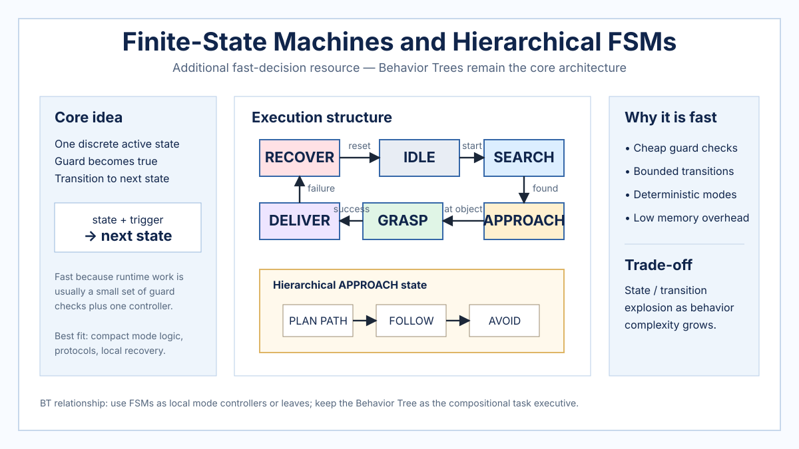

# Finite-State Machines and Hierarchical FSMs

> **Additional resource — Behavior Trees remain the core of this knowledge base.** This page covers finite-state machines (FSMs) and hierarchical finite-state machines (HFSMs) as a comparison architecture for fast robot decision making. The purpose is to clarify when explicit state-transition control is useful and how it differs from Behavior Tree execution.

## Overview

An FSM represents robot behavior as a finite set of discrete states plus transitions guarded by events or conditions. At any instant, the executive is in one active state; the next state is selected by evaluating outgoing transitions. An HFSM adds nesting so that a high-level state can contain its own internal state machine.

FSMs can make decisions with very low latency because the online computation is usually limited to checking a small set of transition guards and executing the active state's controller. Their main scaling problem is structural: as the number of modes and cross-state contingencies grows, the transition graph can become difficult to inspect and maintain.



*Repository-authored generated overview figure. It is a conceptual summary, not a reproduced figure from a paper.*

## Decision model

For a state set $S$, observation $o_t$, and transition function $T$, a simple deterministic executive can be viewed as `state_(t+1) = T(state_t, observation_t)`. The active state then selects or parameterizes the controller executed during the next cycle. In an HFSM, transition resolution may start at the deepest active child and propagate toward a parent state.

## Algorithm: guarded FSM execution

```latex
\begin{algorithmic}[1]
\Require States $S$, initial state $s_0$, ordered outgoing transitions $E(s)$
\Require Current observation $o_t$
\Ensure Active state $s$ and command $u_t$
\State $s \gets s_0$
\While{executive is running}
    \State $o_t \gets \Call{Observe}{}$
    \State $s_{next} \gets s$
    \For{transition $(s, g, s') \in E(s)$}
        \If{$\Call{GuardSatisfied}{g, o_t}$}
            \State $s_{next} \gets s'$
            \State \textbf{break}
        \EndIf
    \EndFor
    \If{$s_{next} \neq s$}
        \State $\Call{Exit}{s}$
        \State $s \gets s_{next}$
        \State $\Call{Enter}{s}$
    \EndIf
    \State $u_t \gets \Call{ExecuteStateController}{s, o_t}$
    \State $\Call{Apply}{u_t}$
\EndWhile
\end{algorithmic}
```

For an HFSM, `E(s)` is evaluated at the deepest active child first; unresolved events may then be offered to the parent state. Entry and exit operations also traverse the active state hierarchy.

## Why decisions can be fast

The decision path is explicit and usually bounded: inspect outgoing guards, take at most one transition, then execute one state's controller. There is no requirement to search a task tree, optimize a horizon, or infer a large learned policy. This makes FSMs attractive for embedded controllers, safety modes, protocol logic, and systems where the relevant modes are few and well defined.

## Relationship to Behavior Trees

Behavior Trees and FSMs can encode many of the same task-level behaviors, but they organize switching differently. An FSM makes the currently active state primary and encodes switching in transitions between states. A Behavior Tree repeatedly evaluates a hierarchy from its root and lets control-flow nodes determine which conditions and actions are ticked.

That distinction matters as behaviors grow. Cross-cutting recovery or priority rules may require transitions from many FSM states, while a BT can often express the same concern as a higher-priority branch or reusable subtree. Conversely, a small FSM can be more direct than a BT when the robot truly has a small number of mutually exclusive modes with simple transitions.

A practical hybrid is common: a BT acts as the task executive while individual leaves contain stateful controllers or small FSMs. This preserves the BT as the main compositional decision structure while using FSMs where explicit mode logic is natural.

## Strengths and limitations

Strengths include deterministic execution, low runtime overhead, direct traceability, and mature tooling. HFSMs improve modularity by containing local transition logic inside composite states. The main limitations are state/transition explosion, brittle cross-state recovery logic, and reduced compositionality when many behaviors need to interact.

## Typical robotics uses

FSM/HFSM control is well suited to device protocols, manipulation phases, navigation modes, startup/shutdown sequences, fault handling, and compact mission controllers. Within a BT-centered system, these are best viewed as local execution mechanisms or comparison architectures rather than replacements for the repository's primary Behavior Tree focus.

## Related resources

- [Behavior Tree foundations](behavior-tree-foundations.md)
- [Behavior Trees in Robotics](robotics-behavior-trees.md)
- [Colledanchise & Ögren (2017) — BT modularity and generalization](../papers/colledanchise-ogren-2017-bt-modularity.md)
- [Reactive Architectures and Subsumption](reactive-architectures-subsumption.md)
