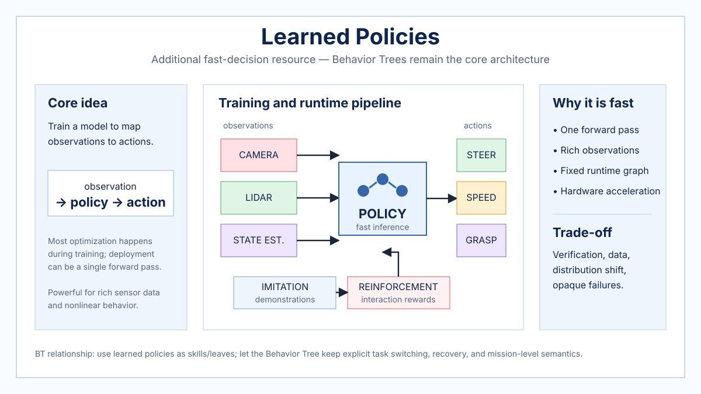

# Learned Policies

> **Additional resource — Behavior Trees remain the core of this knowledge base.** Learned policies are included here to compare explicit BT decision logic with models that map observations directly to actions. They are treated as complementary robot skills or policy modules rather than as a replacement for the repository's Behavior Tree focus.

## Overview

A learned policy computes an action from the robot's current observation using a model trained from demonstrations, reinforcement learning, offline data, simulation, or a combination of these sources. During deployment, the expensive search or optimization that produced the behavior may no longer be present: the robot may only need to preprocess its observation and execute a model forward pass.

This can make online decisions very fast even when the observation contains images, point clouds, proprioception, or other high-dimensional signals. The trade-off is that behavior is encoded in model parameters rather than explicit symbolic control structure, which complicates interpretation, verification, and out-of-distribution behavior.



*Repository-authored generated overview figure. It is a conceptual summary, not a reproduced figure from a paper.*

## Decision model

A deterministic policy can be written conceptually as `action_t = policy_theta(observation_t)`. A stochastic policy instead produces a distribution over actions. In either case, most policy improvement occurs during training. Deployment repeatedly performs sensing, preprocessing, inference, optional safety filtering, and actuation.

## Algorithm: deployed learned policy with a safety gate

```latex
\begin{algorithmic}[1]
\Require Trained policy $\pi_\theta$, observation transform $\phi$
\Require Safety predicate $Safe(o, a)$ and fallback controller $\pi_{safe}$
\Ensure Applied action $a_t$
\While{robot is operating}
    \State $o_t \gets \Call{Observe}{}$
    \State $z_t \gets \Call{Preprocess}{\phi, o_t}$
    \State $a_{policy} \gets \Call{ForwardPass}{\pi_\theta, z_t}$
    \If{$\Call{Safe}{o_t, a_{policy}}$}
        \State $a_t \gets a_{policy}$
    \Else
        \State $a_t \gets \Call{Fallback}{\pi_{safe}, o_t}$
    \EndIf
    \State $\Call{Apply}{a_t}$
\EndWhile
\end{algorithmic}
```

The safety gate is not intrinsic to every learned policy. It is shown because practical robot deployments often benefit from separating high-capacity learned behavior from independent hard constraints, reflexes, or supervisory logic.

## Why decisions can be fast

At runtime, a trained policy can reduce a complex behavioral mapping to one model evaluation. That shifts much of the computational burden to training. With appropriate hardware and model size, inference latency can be compatible with high-rate control or perception-action loops.

The relevant performance quantity is not only neural-network FLOPs. Sensor preprocessing, state estimation, accelerator transfers, and action postprocessing can dominate end-to-end latency, so a policy should be evaluated as part of the complete control loop.

## Relationship to Behavior Trees

Behavior Trees encode task switching and execution structure explicitly, while a learned policy encodes behavior implicitly in parameters. This makes them natural complements. A BT can decide *when* a learned skill should run, monitor preconditions and postconditions, and invoke recovery logic if the learned controller fails. The learned policy can handle the difficult continuous mapping *inside* a leaf.

Examples include a BT leaf that invokes a learned grasp policy, locomotion policy, visual servoing controller, or local navigation policy. The BT remains responsible for task decomposition and recovery, preserving inspectable mission logic while allowing data-driven control where hand engineering is difficult.

End-to-end learned autonomy can remove this explicit hierarchy, but doing so sacrifices many properties that motivate BT use in the first place: modular task structure, explicit priorities, reusable recovery subtrees, and human-readable runtime state.

## Strengths and limitations

Learned policies can process rich observations and represent complex nonlinear behavior with very low online decision overhead. Their weaknesses include training cost, data requirements, distribution shift, opaque failure modes, and verification difficulty. Fast inference alone does not guarantee safe or semantically correct decisions outside the training distribution.

## Typical robotics uses

Learned policies are useful as local skills for grasp selection, manipulation, visual navigation, autonomous driving components, locomotion, drone control, and adaptive low-level control. In this knowledge base they are best understood as a powerful leaf-level or subsystem capability that can be orchestrated by Behavior Trees.

## Related resources

- [Behavior Tree foundations](behavior-tree-foundations.md)
- [Behavior Trees in Robotics](robotics-behavior-trees.md)
- [Iovino et al. (2021) — Learning BTs with genetic programming](../papers/iovino-et-al-2021-genetic-programming.md)
- [Scherf et al. (2023) — Interactive learning from imperfect demonstrations](../papers/scherf-et-al-2023-interactive-learning.md)
- [Utility-Based Action Selection](utility-based-action-selection.md)
