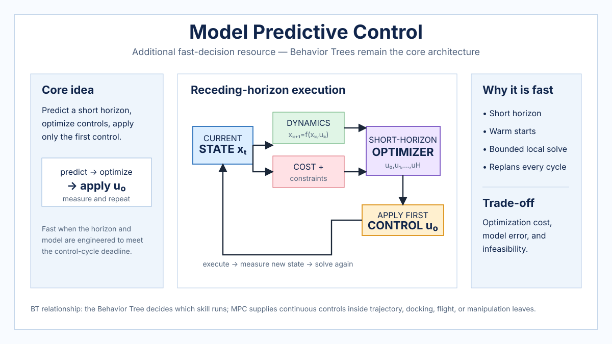

# Model Predictive Control and Receding-Horizon Control

> **Additional resource — Behavior Trees remain the core of this knowledge base.** Model Predictive Control (MPC) is included to show a fundamentally different route to fast online robot decisions: repeated short-horizon optimization. In a BT-centered stack, MPC is typically a controller invoked by a BT action rather than the mission-level executive.

## Overview

MPC repeatedly predicts how a system will evolve over a finite horizon, optimizes a sequence of future controls, applies only the first control, then measures the system again and solves a new problem. This is the receding-horizon principle.

Unlike an FSM or a BT, MPC does not primarily choose among symbolic task branches. It chooses numerical controls by solving an optimization problem subject to a dynamics model, costs, and constraints. With a short horizon, efficient solver, and suitable model, the repeated optimization can run fast enough for vehicle control, drone flight, manipulation, and trajectory tracking.



*Repository-authored generated overview figure. It is a conceptual summary, not a reproduced figure from a paper.*

## Decision model

At time $t$, MPC uses the current state estimate $x_t$ and solves for a finite sequence of controls. Conceptually, `U* = argmin_U J(x_t, U)` subject to the model dynamics and state/input constraints. Only the first action `u*_0` is applied. At the next cycle the horizon shifts forward and the problem is solved again with a new state estimate.

## Algorithm: receding-horizon MPC

```latex
\begin{algorithmic}[1]
\Require Dynamics model $f$, horizon $H$, cost $J$, constraints $\mathcal{C}$
\Require State estimator and optimizer
\Ensure Applied control $u_t$
\State $U_{warm} \gets \Call{InitialGuess}{}$
\While{controller is running}
    \State $x_t \gets \Call{EstimateState}{}$
    \State $U^* \gets \Call{SolveOptimization}{x_t, f, J, \mathcal{C}, H, U_{warm}}$
    \If{$U^*$ is feasible}
        \State $u_t \gets U^*[0]$
        \State $U_{warm} \gets \Call{ShiftHorizon}{U^*}$
    \Else
        \State $u_t \gets \Call{SafeFallback}{x_t}$
        \State $U_{warm} \gets \Call{InitialGuess}{}$
    \EndIf
    \State $\Call{Apply}{u_t}$
\EndWhile
\end{algorithmic}
```

Warm-starting the optimizer from the previous solution is one of several techniques that can reduce solve time. Other implementation choices include linearization, sparse solvers, reduced-order models, and shorter horizons.

## Why decisions can be fast

MPC deliberately limits how far ahead it optimizes. Instead of solving an entire mission once, it repeatedly solves a bounded local problem. The controller benefits from the newest state estimate at every cycle and naturally incorporates constraints such as steering limits, acceleration bounds, actuator saturation, collision margins, or terminal conditions.

The method is not automatically low latency. Runtime depends strongly on model complexity, horizon length, constraint count, solver choice, warm starts, and hardware. MPC belongs in the fast-decision landscape when the problem is engineered so that the worst-case solve time fits the control deadline.

## Relationship to Behavior Trees

Behavior Trees and MPC operate at different abstraction levels in many robot systems. A BT is well suited to deciding *which task or skill should execute* and to structuring fallback, recovery, and mission priorities. MPC is well suited to deciding *which numerical control should be applied next* while satisfying continuous dynamics and constraints.

A common architecture therefore keeps the BT as the executive and uses MPC inside leaves such as `FollowTrajectory`, `Dock`, `AvoidObstacle`, `TrackTarget`, or `Land`. The leaf returns Running while MPC controls the system, Success when its terminal condition is reached, and Failure when the optimizer becomes infeasible or another execution fault occurs.

This separation preserves the repository's BT-centered task structure while adding a powerful continuous-control method underneath it.

## Strengths and limitations

MPC is constraint-aware, adaptive to new measurements, and able to trade tracking performance against control effort or risk. Its predicted trajectory also provides useful introspection for higher-level monitoring. The main costs are computation and modeling: poor dynamics models can degrade control, nonconvex problems can be difficult to solve reliably, and worst-case optimization time can violate hard real-time requirements.

## Typical robotics uses

MPC is common in autonomous driving, aerial vehicles, mobile robots, legged systems, manipulation, process control, and trajectory tracking. Within a Behavior Tree architecture, it is most naturally treated as a continuous controller behind one or more action nodes.

## Related resources

- [Behavior Tree foundations](behavior-tree-foundations.md)
- [Behavior Trees in Robotics](robotics-behavior-trees.md)
- [Reactive Architectures and Subsumption](reactive-architectures-subsumption.md)
- [Learned Policies](learned-policies.md)
