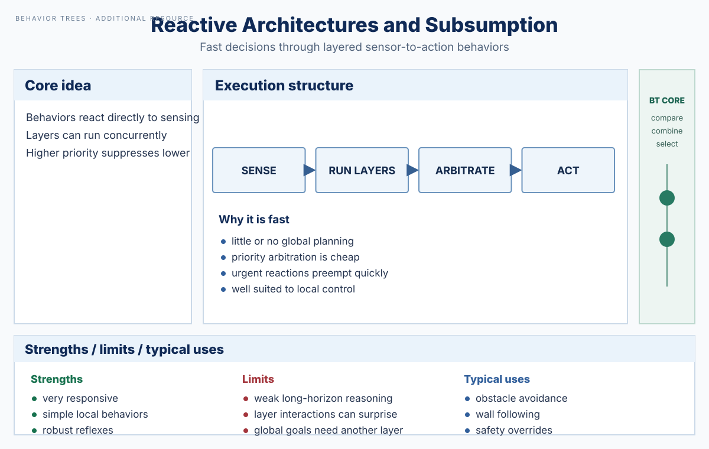

# Reactive Architectures and Subsumption

> **Additional resource — Behavior Trees remain the core of this knowledge base.** Reactive and subsumption-style architectures are included here as an important comparison for understanding low-latency robot behavior selection. They are not a new primary scope for the repository.

## Overview

Reactive architectures minimize deliberation between perception and action. Instead of constructing a long plan, several behavior modules continuously map sensed conditions to candidate commands. An arbitration rule determines which command reaches the robot.

Subsumption is a canonical layered form: low-level behaviors provide basic competence, while higher-priority behaviors can suppress or inhibit lower layers when more urgent conditions appear. For example, a robot may normally wander, switch to goal following when a target exists, and immediately allow obstacle avoidance or emergency stop to override both.



*Repository-authored generated overview figure. It is a conceptual summary, not a reproduced figure from a paper.*

## Decision model

Let each behavior $b_i$ map the current observation to a candidate command and an activation signal: `(active_i, command_i) = b_i(observation)`. A priority arbiter selects the highest-priority active behavior. The architecture can therefore react within a single sensing/control cycle without constructing an explicit task plan.

## Algorithm: priority-based reactive arbitration

```latex
\begin{algorithmic}[1]
\Require Behaviors $B = [b_1, b_2, \ldots, b_n]$ ordered from highest to lowest priority
\Require Sensor observation $o_t$
\Ensure Applied command $u_t$
\While{controller is running}
    \State $o_t \gets \Call{Observe}{}$
    \State $selected \gets \varnothing$
    \For{$b_i \in B$}
        \State $(active_i, u_i) \gets \Call{EvaluateBehavior}{b_i, o_t}$
        \If{$active_i$}
            \State $selected \gets (b_i, u_i)$
            \State \textbf{break}
        \EndIf
    \EndFor
    \If{$selected = \varnothing$}
        \State $u_t \gets \Call{SafeDefaultCommand}{}$
    \Else
        \State $u_t \gets selected.command$
    \EndIf
    \State $\Call{Apply}{u_t}$
\EndWhile
\end{algorithmic}
```

A true subsumption implementation may run behavior modules concurrently and perform suppression at signal interfaces rather than evaluating them sequentially. The pseudocode expresses the same priority semantics in an executive-friendly form.

## Why decisions can be fast

There is little or no online search. Each behavior performs a local sensor-to-action computation, and arbitration is usually a small priority comparison. This makes the architecture effective for collision avoidance, stabilization, contact reflexes, and other behaviors where response latency matters more than long-horizon reasoning.

## Relationship to Behavior Trees

Both Behavior Trees and subsumption can express priority and preemption, but they do so differently. Subsumption emphasizes continuously active behavior layers and suppression among their outputs. A BT emphasizes explicit hierarchical task logic that is ticked repeatedly and returns execution statuses such as Success, Failure, and Running.

A reactive layer is therefore often complementary to a BT. The BT can remain the mission/task executive while low-level reflexes, collision avoidance, or safety controllers operate underneath it. Alternatively, a BT fallback/selector can encode a priority ordering similar to subsumption while retaining explicit task hierarchy and status semantics.

The key design question is where the switching logic belongs. If the decision is a fast local reaction to sensor state, a reactive controller may be appropriate. If the system needs reusable task decomposition, recovery structure, and inspectable execution progress, the BT usually remains the stronger top-level abstraction.

## Strengths and limitations

Reactive architectures are responsive, computationally light, and robust to rapidly changing local conditions. Their weakness is global coordination: independent local behaviors can conflict, oscillate, or produce emergent behavior that is difficult to reason about. Purely reactive systems also have limited ability to represent long-horizon task dependencies or explicit completion semantics.

## Typical robotics uses

Common uses include obstacle avoidance, wall following, stabilization, collision reflexes, emergency overrides, and simple mobile-robot navigation. In a BT-centered autonomy stack, these mechanisms are most useful below the BT or inside specialized leaves rather than as a replacement for the task-level Behavior Tree.

## Related resources

- [Behavior Tree foundations](behavior-tree-foundations.md)
- [Finite-State Machines and Hierarchical FSMs](finite-state-machines-hfsm.md)
- [Utility-Based Action Selection](utility-based-action-selection.md)
- [Colledanchise & Ögren (2017) — BT modularity and generalization](../papers/colledanchise-ogren-2017-bt-modularity.md)
