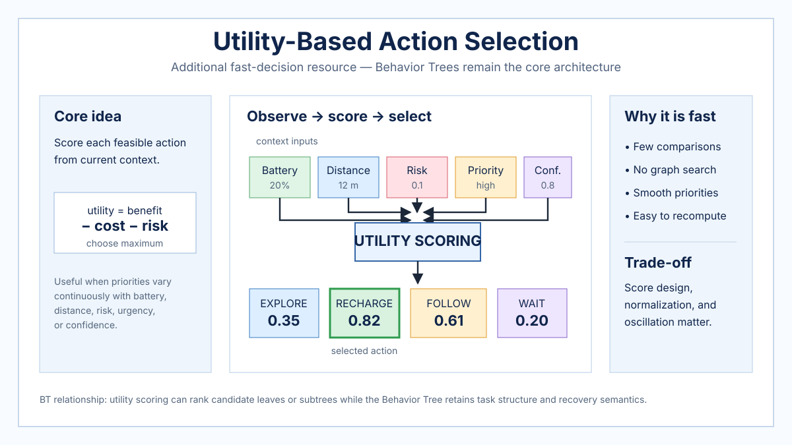

# Utility-Based Action Selection

> **Additional resource — Behavior Trees remain the core of this knowledge base.** Utility-based action selection is included as a comparison mechanism for fast robot behavior choice, especially when several objectives compete continuously.

## Overview

A utility system assigns each candidate action a numerical score from the current robot state and context, then executes the action with the highest admissible score. Instead of encoding a large number of explicit transitions, the designer defines scoring functions that express preferences such as progress, safety, energy, urgency, confidence, or task value.

The method is fast when the number of candidate actions is modest and the score functions are inexpensive. It also makes trade-offs explicit: a recharge action can become more desirable as battery level falls, while collision risk can sharply lower the score of aggressive motion.



*Repository-authored generated overview figure. It is a conceptual summary, not a reproduced figure from a paper.*

## Decision model

For candidate action $a_i$ and context vector $x_t$, define a utility function $U_i(x_t)$. The selected action is `a* = argmax_i U_i(x_t)` subject to any hard safety or feasibility constraints. Utility functions may be linear weighted sums, nonlinear curves, learned functions, or combinations of normalized considerations.

## Algorithm: utility-scored action selection

```latex
\begin{algorithmic}[1]
\Require Candidate actions $A = \{a_1, \ldots, a_n\}$
\Require Utility functions $U_i(x)$ and feasibility predicates $F_i(x)$
\Require Previous action $a_{prev}$ and optional switching margin $\delta$
\Ensure Selected action $a^*$
\While{executive is running}
    \State $x_t \gets \Call{ObserveContext}{}$
    \State $bestScore \gets -\infty$
    \State $a^* \gets \Call{SafeDefaultAction}{}$
    \For{$a_i \in A$}
        \If{$\Call{Feasible}{F_i, x_t}$}
            \State $score_i \gets \Call{Utility}{U_i, x_t}$
            \If{$score_i > bestScore$}
                \State $bestScore \gets score_i$
                \State $a^* \gets a_i$
            \EndIf
        \EndIf
    \EndFor
    \If{$a^* \neq a_{prev}$ \textbf{ and } $bestScore < U_{prev}(x_t) + \delta$}
        \State $a^* \gets a_{prev}$ \Comment{optional hysteresis}
    \EndIf
    \State $\Call{Execute}{a^*}$
    \State $a_{prev} \gets a^*$
\EndWhile
\end{algorithmic}
```

The optional switching margin prevents small score fluctuations from causing rapid action oscillation. Hard constraints should generally be applied before utility comparison rather than represented only as soft negative scores.

## Why decisions can be fast

The online computation is typically `observe -> score -> compare -> act`. If there are $n$ candidate actions and each score is constant-time, selection is approximately linear in $n$ and does not require a graph search or long-horizon optimization.

Utility systems are especially attractive when priorities vary smoothly. They avoid hard switching thresholds where a tiny change in state can completely alter a hand-written transition rule.

## Relationship to Behavior Trees

A Behavior Tree usually represents decision structure explicitly: conditions and control-flow nodes determine which branch is ticked. A utility system instead flattens part of that choice into a numerical ranking problem.

The two approaches can be combined without changing the repository's BT-centered architecture. A BT selector can call a utility-based leaf to rank navigation targets, manipulation strategies, or recovery choices. Conversely, utility scores can parameterize which BT subtree is preferred when several subtrees are all valid.

BTs remain stronger when task ordering, completion state, fallback structure, and reusable hierarchy are central. Utility selection is stronger when several valid actions must be continuously ranked according to changing quantitative preferences.

## Strengths and limitations

Utility selection is flexible, compact, and naturally supports multi-objective trade-offs. Its main difficulty is score design. Poor normalization can make one consideration dominate unintentionally; closely matched scores can cause oscillation; and a numerically attractive action can still be unsafe if safety is treated only as another soft preference.

## Typical robotics uses

Typical uses include resource management, target selection, task prioritization, strategy selection, recovery ranking, and service-robot behavior choice. In a BT-based robot, utility scoring is most naturally used as an arbitration primitive inside an otherwise explicit task hierarchy.

## Related resources

- [Behavior Tree foundations](behavior-tree-foundations.md)
- [Reactive Architectures and Subsumption](reactive-architectures-subsumption.md)
- [Learned Policies](learned-policies.md)
- [Behavior Trees in Robotics](robotics-behavior-trees.md)
